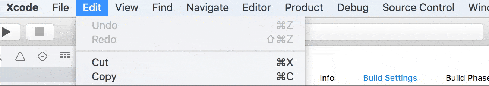

# StatusIndicator

StatusIndicator lets you display a custom status in Xcode's toolbar from a Xcode plugin.  
This framework uses unofficial and undocumented APIs and might stop working with the new releases of Xcode.

[ [Motivation](#motivation) &bull; [Integration](#integration)
&bull; [Usage](#usage) &bull; [Contributing](#contributing) &bull; [License](#license) ]

What you can do with it is basically this:



You might want to use it along with [Troublemaker](https://github.com/thelvis4/Troublemaker), a framework that lets you add custom warnings and errors in Xcode.


## Motivation
A Xcode plugin allow us to access the structure of Xcode: windows, views and menus hierarchies. That means, if we are courageous enough, we can customize the Xcode. One of the most common customizations is adding a menu option that runs a custom defined task: Code quality checks, code standards, etc.  
**What's the problem?**  
When we need to run a tool that takes more that a couple of seconds(OCLint takes much more) to finish, we might want to dispatch a task in the backround queue in order to prevent main thread blocking.  
While the tool is working(and before showing warnings) there is no feedback at all. And that's very bad. The user doesn't feel in control, he doesn't know what happens, and even worse, he can run the same command multiple times.  
**The Solution**  
A nice way to show the informations about running tool, the progress and the results would be to use Xcode's toolbar, especially the part showing the status of different activities(Build, Test, Cleaning...).  
Xcode doesn't provide any official way to use those elements, so I had to hack it again. :hammer: 

## Integration

#### Clone the project
```shell
git clone git@github.com:thelvis4/StatusIndicator.git
```
Pull the submodules:  
StatusIndicator depends on [XcodeIDEKit](https://github.com/thelvis4/XcodeIDEKit). 
```shell
cd StatusIndicator
git submodule update --init
```

##### Build and import the framework
- Build StatusIndicator.
- In Xcode, Go to `Products` group.
- Right-click on `StatusIndicator.framework` => `Show in Finder`
- Drag and drop `StatusIndicator.framework` and `XcodeIDEKit.framework` in your project.


##### As Xcode subproject
- Drag and drop `StatusIndicator.xcodeproj` file into your project.
- In `Build Phases` => `Target Dependencies` add `StatusIndicator` framework as dependency.
- Add `StatusIndicator` to `Link Binary With Libraries`


## Usage
For a complete example of how to use the StatusIndicator framework, see the [Demo project](https://github.com/thelvis4/StatusIndicator/tree/master/Examples/StatusIndicator_demo).


##### Initialize StatusIndicator
```Swift
guard let indicator = StatusIndicator() else {
    print("Could not initialize StatusIndicator. Probably there is no Project window open in Xcode.")
    return
}
```

##### Create a Status
* Plain text Status:  
Plain text data lets you display a simple status.  
Ex: `Loading Awesome Tool...`
```Swift
let data = StatusData.Plain("Loading...")
let status = Status(data: data)
```
* Segmented Status:  
Segmented data lets you display a status composed of multiple components.  
Ex: `Awesome Tool | Checking: Succeeded | Today at 9:41 AM`
```Swift
let segments = SegmentGenerator.segmentsForRunningTool(toolName, currentStep: operationDescription)
let data = StatusData.Segmented(segments)
let status = Status(data: data)
```

##### Show the status in Xcode
```Swift
indicator.addStatus(status)
```

##### Change the progress
It takes a value from 0.0 to 1.0. Change the `progress` value while the operation is getting done to let the user know how much time left to wait.
```Swift
status.progress = 0.5
```

##### Remove the status
When the operation is done, remove the status. It's recomended to set the status as completed before removing the status. This will make sure the progress indicator in Xcode's status view is properly dismissed.
```Swift
status.completed = true
indicator.removeStatus(status)
```

## Contributing
This project is WIP. If you've spotted a bug or an issue, please open a [New Issue](https://github.com/thelvis4/StatusIndicator/issues/new).  
If you want to contribute to the codebase, please submit a [Pull request](https://help.github.com/articles/using-pull-requests/).

## License
This project is [MIT licensed](https://github.com/thelvis4/StatusIndicator/blob/master/LICENSE.md).
